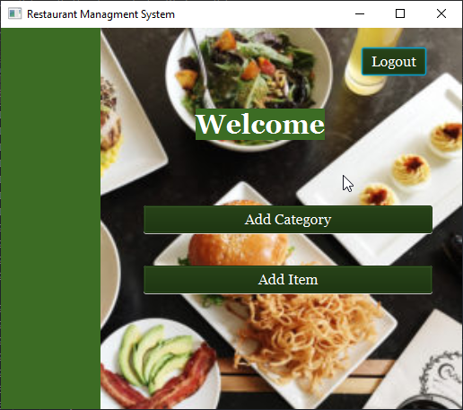
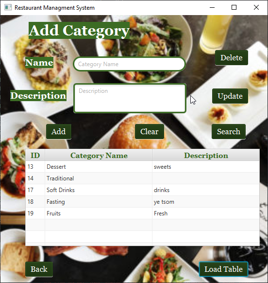
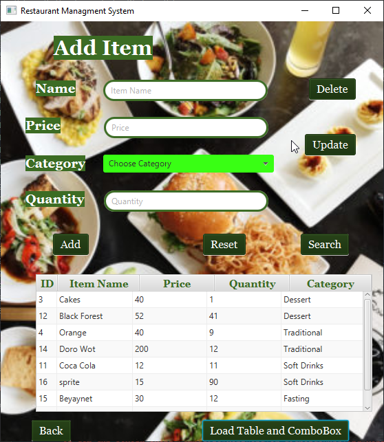
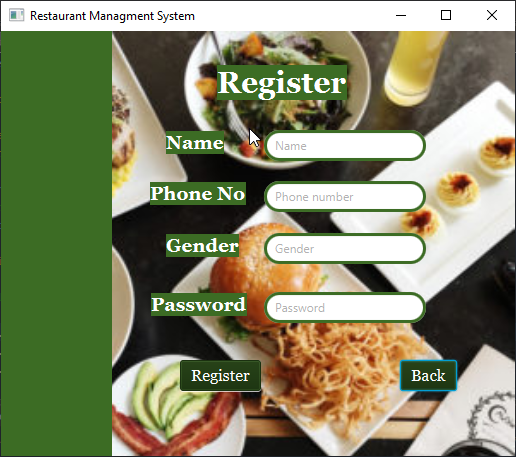
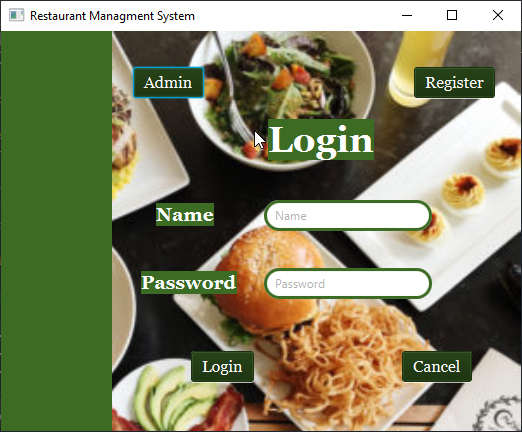
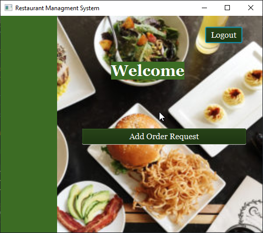
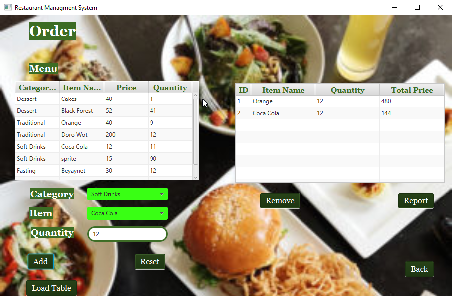
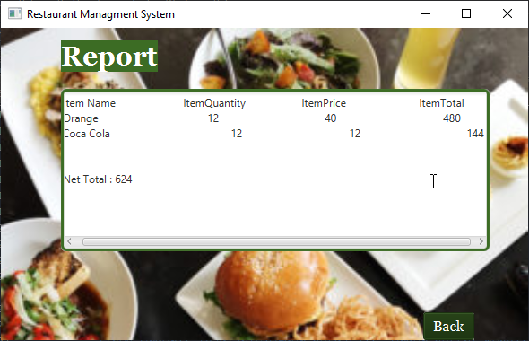

# Restaurant Managment System using JAVAFX

## Table of contents

- [Overview](#overview)
- [Screenshot](#screenshot)
- [Links](#links)
- [Built with](#built-with)
- [Useful resources](#useful-resources)
- [Author](#author)

## Overview

This project is restaurant management system which has both admin and the user side functionalities. Admins can add and manage different Categories and Items. Users can Order Foods and able to get total price of the ordered items. The system can register both admin and user. 

## Screenshot

## Links

- The Database: [DB](restaurant_ms.sql)

## Built with

- JAVAFX
- CSS custom properties
- MY SQL Query Browser

## Useful resources

- Youtube: [Ram Alapure](https://www.youtube.com/playlist?list=PLeyMYhyx349ZZLdyNf1I7RODb83UwkJYo)

## Author

- Author - [@Ezmad-Ze]

